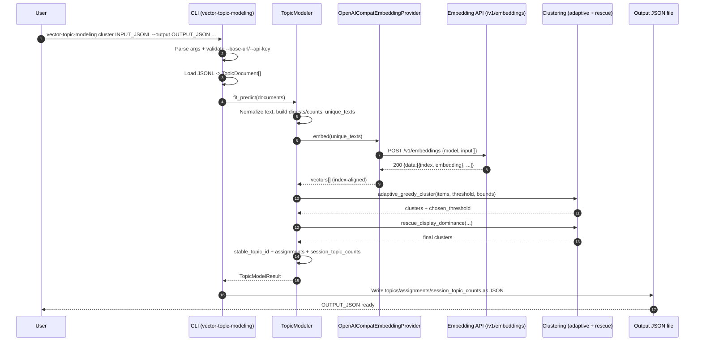
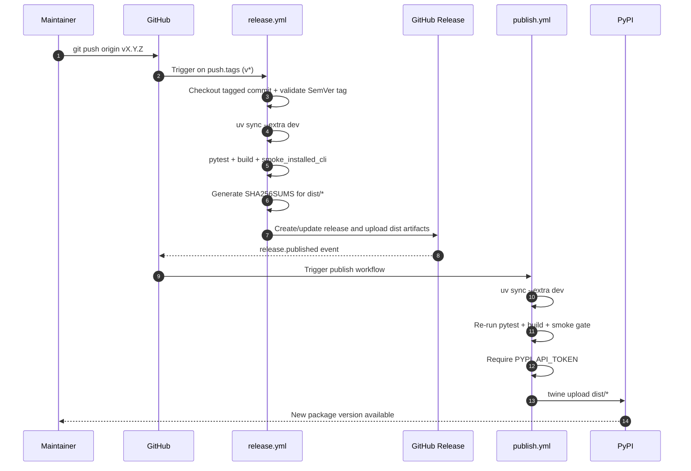

# Vector Topic Modeling User Manual

Package: `vector-topic-modeling`  
Python: `>=3.11`  
CLI: `vector-topic-modeling`

## 1) Installation

### 1.1 Prerequisites

- Python 3.11+
- `uv` (recommended for development and verification)

### 1.2 Install from source

```bash
git clone https://github.com/seonghobae/vector-topic-modeling.git
cd vector-topic-modeling
uv sync
```

### 1.3 Install from wheel

```bash
python3.11 -m pip install dist/vector_topic_modeling-<version>-py3-none-any.whl
```

### 1.4 Verify installation

```bash
vector-topic-modeling --help
vector-topic-modeling cluster --help
```

## 2) Quick Start

### 2.1 Python API

```python
from vector_topic_modeling import TopicDocument, TopicModelConfig, TopicModeler


class FakeEmbeddingProvider:
    def embed(self, texts: list[str]) -> list[list[float]]:
        return [[1.0, 0.0] for _ in texts]


modeler = TopicModeler(
    embedding_provider=FakeEmbeddingProvider(),
    config=TopicModelConfig(similarity_threshold=0.85),
)

result = modeler.fit_predict(
    [
        TopicDocument(id="1", text="refund duplicate billing"),
        TopicDocument(id="2", text="cancel subscription refund"),
    ]
)

print(len(result.topics), len(result.assignments))
```

### 2.2 CLI

```bash
vector-topic-modeling cluster examples/sample_queries.jsonl \
  --output topics.json \
  --base-url "$LITELLM_API_BASE" \
  --api-key "$LITELLM_API_KEY" \
  --model text-embedding-3-large
```

## 3) JSONL Input / Output

### 3.1 Input shape

One JSON object per line:

```json
{"id":"1","text":"refund duplicate billing","session_id":"s1","question":"...","response":"...","count":1}
```

### 3.2 Input field behavior

- `id`: preferred identifier; falls back to `document_id`, then row index
- `text`: defaults to `""` when absent
- `session_id`, `question`, `response`: optional
- `count`: defaults to `1`

### 3.3 Output shape (`--output`)

Top-level keys:

- `topics`
- `assignments`
- `session_topic_counts`

## 4) CLI Options Explained

Command pattern:

```bash
vector-topic-modeling cluster INPUT_JSONL --output OUTPUT_JSON
```

| Option | Required | Default | Description |
| --- | --- | --- | --- |
| `input_path` | yes | - | Input JSONL file path |
| `--output` | yes | - | Output JSON path |
| `--base-url` | runtime-required | - | OpenAI-compatible embedding endpoint URL |
| `--api-key` | runtime-required | - | API key used for embedding requests |
| `--model` | no | `text-embedding-3-large` | Embedding model |
| `--similarity-threshold` | no | `0.85` | Clustering similarity threshold |

Example with stricter threshold:

```bash
vector-topic-modeling cluster input.jsonl \
  --output topics.json \
  --base-url "$LITELLM_API_BASE" \
  --api-key "$LITELLM_API_KEY" \
  --model text-embedding-3-large \
  --similarity-threshold 0.90
```

## 5) Troubleshooting

### 5.1 `cluster requires --base-url and --api-key`

Provide both arguments:

```bash
--base-url https://... --api-key ...
```

### 5.2 `base_url must be a valid http(s) URL`

Use an endpoint starting with `http://` or `https://`.

### 5.3 Embedding request failures

- Verify endpoint reachability
- Verify API key
- Retry with a minimal single-row input

### 5.4 Smoke test cannot find wheel

If the script reports `Expected exactly one wheel`:

```bash
rm -rf dist .venv-smoke-cli
uv run python -m build
uv run python scripts/smoke_installed_cli.py --dist-dir dist --venv-dir .venv-smoke-cli
```

## 6) Release Operations (Maintainers)

### 6.1 Local release verification

```bash
uv sync --extra dev
uv run pytest -q
rm -rf dist .venv-smoke-cli
uv run python -m build
uv run python scripts/smoke_installed_cli.py --dist-dir dist --venv-dir .venv-smoke-cli
```

### 6.2 Automated release flow

1. Push a SemVer tag prefixed with `v`:

   ```bash
   git checkout main
   git pull --ff-only
   git tag v0.1.1
   git push origin v0.1.1
   ```

2. `.github/workflows/release.yml` verifies tests/build/smoke and creates a
   GitHub Release with built artifacts.
3. `.github/workflows/publish.yml` then runs on `release.published` and uploads
   to PyPI when `PYPI_API_TOKEN` is configured.

### 6.3 Manual release trigger

You can also run `release.yml` via **workflow_dispatch** with an existing tag.

## 7) Sequence Diagrams

### 7.1 CLI clustering runtime flow



### 7.2 Release automation flow


